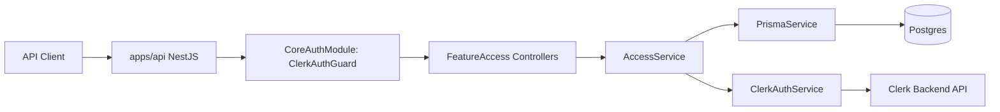
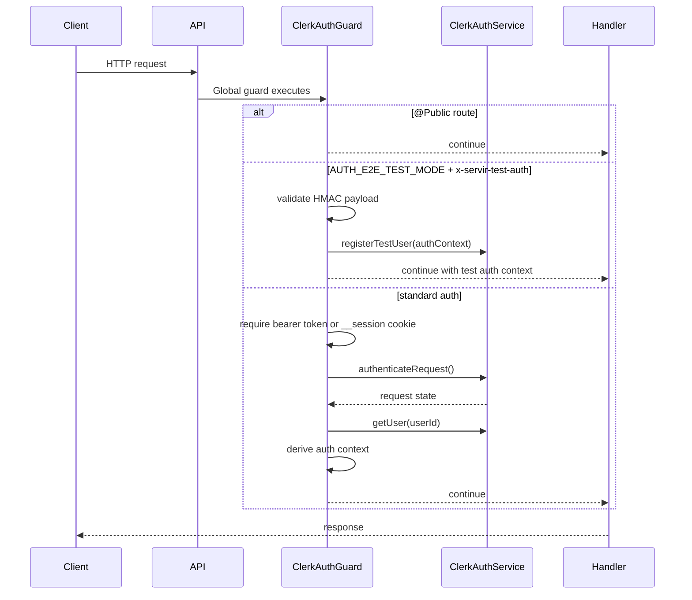
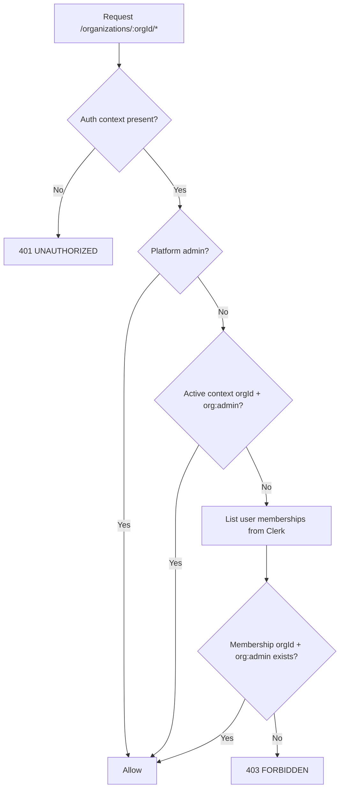
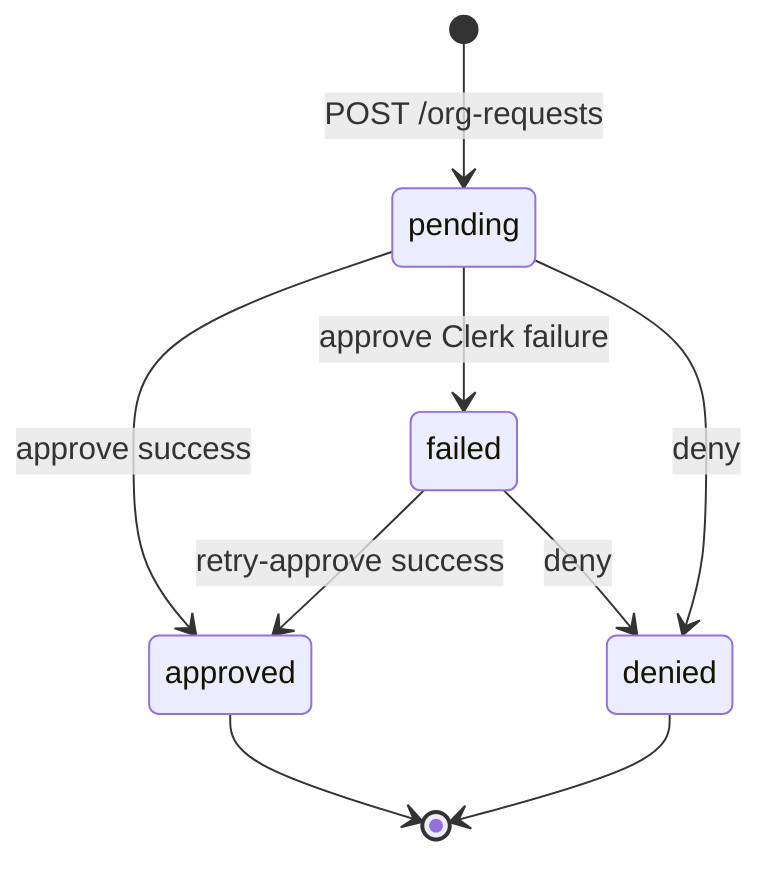
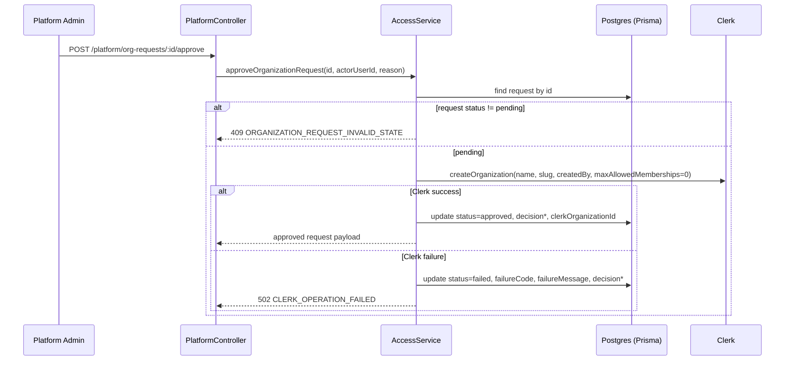

# Clerk Auth + Organization Governance (API Foundation)

## Scope

This document describes how authentication, authorization, organization request governance, and organization member management work in `@servir/api`.

Current scope:

- API only (no Web/Expo integration details)
- Clerk-backed auth and org operations
- Postgres + Prisma persistence for organization request workflow and audit fields
- Standardized API error envelope via `ApiErrorSchema`

## High-Level Architecture

Main modules involved:

- `apps/api/src/modules/app/app.module.ts`
- `libs/server/core-auth` (global auth + auth guards)
- `libs/server/data-access` (Prisma service)
- `libs/server/feature-access` (auth/org/platform endpoints)
- `libs/server/core` (error envelope filters)
- `libs/shared/contracts` (request/response/error schemas)
- `libs/shared/config` (environment schema)

## Request Pipeline

Auth context fields set on request:

- `userId`
- `email`
- `firstName`
- `lastName`
- `isPlatformAdmin`
- `activeOrganizationId`
- `activeOrganizationRole`

Platform admin source of truth:

- Clerk user `privateMetadata.platformRole === "platform_admin"`
- `privateMetadata.platform_role` is also accepted for compatibility

## Authorization Model

### Platform endpoints

- Guard: `PlatformAdminGuard`
- Rule: authenticated user must have `isPlatformAdmin === true`

### Organization endpoints (`/organizations/:orgId/*`)

- Guard: `OrgAdminGuard`
- Rule: allow if any of the following is true:
  - user is platform admin
  - active org context is `orgId` and role is `org:admin`
  - Clerk membership lookup confirms `org:admin` in `orgId`

## Endpoint Matrix

All routes are under `API_PREFIX` (default: `api/v1`).

| Endpoint | Method | Access |
| --- | --- | --- |
| `/auth/me` | GET | Authenticated user |
| `/org-requests` | POST | Authenticated user |
| `/org-requests/me` | GET | Authenticated user (own requests only) |
| `/platform/org-requests` | GET | Platform admin |
| `/platform/org-requests/:requestId/approve` | POST | Platform admin |
| `/platform/org-requests/:requestId/deny` | POST | Platform admin |
| `/platform/org-requests/:requestId/retry-approve` | POST | Platform admin |
| `/platform/users` | GET | Platform admin |
| `/organizations/:orgId/members` | GET | Org admin of `orgId` or platform admin |
| `/organizations/:orgId/invitations` | POST | Org admin of `orgId` or platform admin |
| `/organizations/:orgId/members/:membershipId/role` | PATCH | Org admin of `orgId` or platform admin |
| `/organizations/:orgId/members/:membershipId` | DELETE | Org admin of `orgId` or platform admin |

## Organization Request Lifecycle

Statuses:

- `pending`
- `approved`
- `denied`
- `failed`

Notes:

- Duplicate pending request protection is by requester + normalized slug family.
  - If requester has pending slug `acme`, another pending request for `acme` or `acme-*` is rejected (`409 ORGANIZATION_REQUEST_PENDING_EXISTS`).
- Slug generation is deterministic:
  - base slug from organization name
  - if taken, uses `-2`, `-3`, ...
- Denied requests can be resubmitted as new requests (new row).

## Approval and Failure Handling

On approve success:

- Clerk org is created
- Requester is initial `org:admin` (via Clerk org create behavior with `createdBy`)
- `maxAllowedMemberships` is set to `0` (unlimited)
- `clerkOrganizationId`, `decisionedByUserId`, `decisionedAt`, `decisionReason` are persisted

## Member Management Behavior

Member endpoints use `membershipId` in the route. For role update/delete:

1. Service resolves membership by listing org memberships.
2. Service maps membership to `userId`.
3. Clerk update/delete calls are made with `organizationId + userId`.

This keeps external API ergonomic while matching Clerk backend API inputs.

## Persistence Model

`OrganizationRequest` table (`apps/api/prisma/schema.prisma`):

- identity: `id (uuid)`
- requester: `requesterUserId`, `requesterEmail`
- request payload: `organizationName`, `organizationSlug`, `justification`
- workflow: `status`
- decision audit: `decisionReason`, `decisionedByUserId`, `decisionedAt`
- approval linkage: `clerkOrganizationId`
- failure audit: `failureCode`, `failureMessage`
- timestamps: `createdAt`, `updatedAt`

Indexes:

- `(requesterUserId, status)`
- `(status, createdAt)`
- `(organizationSlug)`

## Error Standardization

Global filters produce standardized envelope from `ApiErrorSchema`:

- `ZodExceptionFilter` maps:
  - request validation -> `400 VALIDATION_ERROR`
  - response serialization -> `500 SERIALIZATION_ERROR`
- `HttpExceptionEnvelopeFilter` maps `HttpException` to envelope with codes such as:
  - `UNAUTHORIZED`, `FORBIDDEN`, `NOT_FOUND`, `CONFLICT`, `BAD_REQUEST`, `INTERNAL_ERROR`
- Domain/service errors use `ApiHttpException` with explicit domain codes such as:
  - `ORGANIZATION_REQUEST_PENDING_EXISTS`
  - `ORGANIZATION_REQUEST_INVALID_STATE`
  - `CLERK_OPERATION_FAILED`

## Environment Variables

Primary variables used by this foundation:

- `DATABASE_URL`
- `CLERK_PUBLISHABLE_KEY`
- `CLERK_SECRET_KEY`
- `CLERK_AUTHORIZED_PARTIES` (comma-separated)
- `AUTH_E2E_TEST_MODE`
- `AUTH_E2E_TEST_SECRET`

Definitions live in:

- `libs/shared/config/src/lib/config.ts`

Examples:

- `apps/api/.env.example`
- `apps/api/.env.test`
- `docker-compose.yml`

Clerk dashboard configuration checklist:

- `docs/api/clerk-settings.md`

## E2E Test Mode

When `AUTH_E2E_TEST_MODE=true`:

- Auth guard accepts signed `x-servir-test-auth` header.
- Payload is HMAC-verified with `AUTH_E2E_TEST_SECRET`.
- ClerkAuthService uses in-memory test users/orgs/memberships/invitations.
- Special behavior for retry testing: org slugs containing `fail-once` fail first creation attempt.

This enables deterministic auth and org-governance integration tests without relying on live Clerk state.

## Billing Layer

Billing is implemented as a separate enforcement layer and webhook projection workflow.

- Architecture: `docs/api/billing-architecture.md`
- Webhooks: `docs/api/billing-webhooks.md`
- Operations: `docs/api/billing-operations.md`
