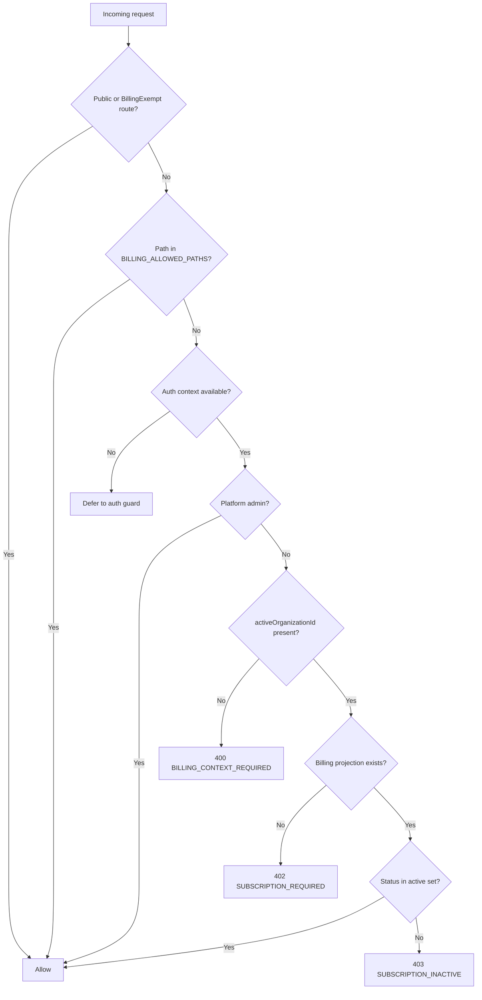

# Billing Architecture (Webhook-First)

## Scope

This document describes the billing architecture for `@servir/api` using Clerk Billing and API webhook ingestion (no queue worker or Inngest in this phase).

## System Context

```mermaid
flowchart LR
  Clerk[Clerk Billing] --> Webhook[POST /api/v1/internal/webhooks/clerk]
  Webhook --> BillingSvc[BillingService]
  BillingSvc --> Prisma[PrismaService]
  Prisma --> DB[(Postgres)]

  Client[API Client] --> API[@servir/api]
  API --> Auth[ClerkAuthGuard]
  Auth --> BillingGuard[BillingGuard]
  BillingGuard --> Prisma
```

## Data Flow

1. Clerk sends signed webhook to API.
2. API verifies signature.
3. API enforces idempotency using `provider + eventId`.
4. API updates `OrganizationBilling` projection and logs `BillingWebhookEvent`.
5. Runtime requests evaluate billing via `BillingGuard` + local projection.

## Enforcement Flow



## Persistence

Billing projection tables:

- `OrganizationBilling`
- `BillingWebhookEvent`

The projection is the enforcement source for API authorization decisions.

## Retry and Idempotency

- Signature failures return auth errors and are not processed.
- Duplicate event ids return `duplicate` acknowledgment.
- Processing failures return non-2xx to let Clerk retry.

