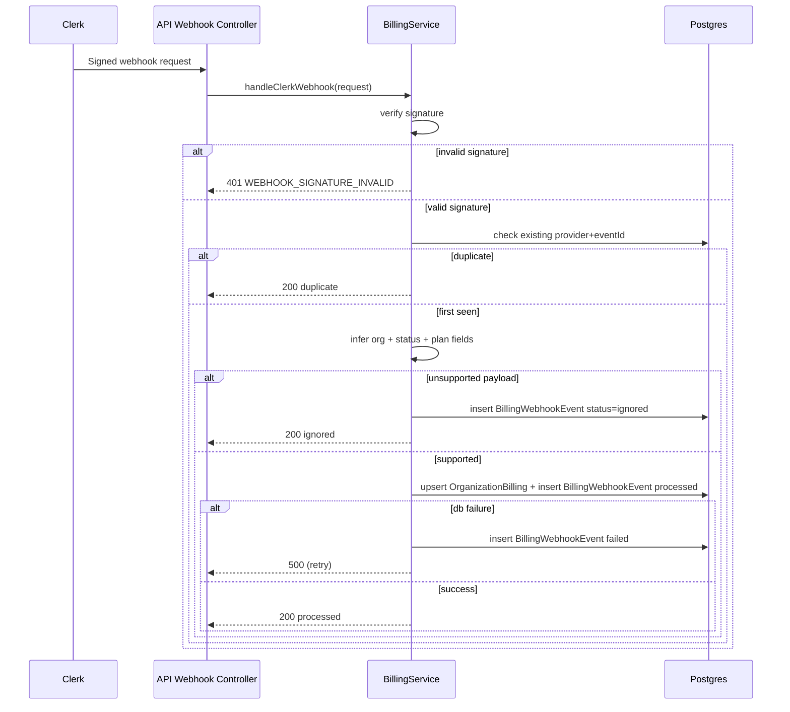
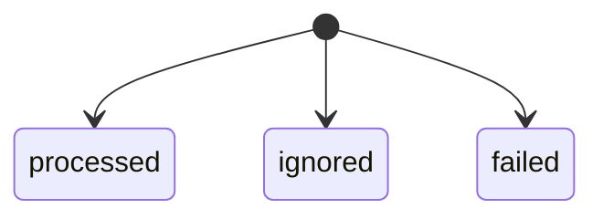

# Billing Webhooks

## Endpoint

- `POST /api/v1/internal/webhooks/clerk`
- Route is `@Public()` and `@BillingExempt()`, but signature verification is mandatory.

## Processing Sequence

## Event State

## Operational Notes

1. Idempotency key: `provider + eventId`.
2. `eventId` source: `svix-id` header.
3. Keep webhook responses fast; no external side effects in the critical path.
4. Fail closed on signature verification.

